# Architecture

## Overview

```mermaid
flowchart TB
    subgraph Client["🖥️ Client"]
        UI[Web/Mobile UI]
    end
    
    subgraph Backend["⚙️ Backend"]
        API[API Server]
        GEMINI[Gemini Client]
    end
    
    subgraph Google["☁️ Google Cloud"]
        G3[Gemini 3 API]
    end
    
    UI --> API
    API --> GEMINI
    GEMINI --> G3
    G3 --> GEMINI
    GEMINI --> API
    API --> UI
```



## Components

### 1. Client Layer
- **Technology:** [React/Svelte/Vue/etc.]
- **Responsibility:** User interface, input collection, response display

### 2. API Layer
- **Technology:** [FastAPI/Express/etc.]
- **Responsibility:** Request handling, validation, orchestration

### 3. Gemini Integration
- **Technology:** `google-generativeai` Python SDK / `@google/generative-ai` Node.js
- **Model:** Gemini 3 Pro / Flash
- **Features Used:**
  - [ ] Text generation
  - [ ] Vision (image understanding)
  - [ ] Audio processing
  - [ ] Function calling
  - [ ] Streaming

## Data Flow

1. User submits request via UI
2. API validates and preprocesses request
3. Gemini client constructs prompt with context
4. Gemini 3 API processes and returns response
5. Response is post-processed and returned to user

## Gemini Integration Details

### Model Selection

| Use Case | Model | Reason |
|----------|-------|--------|
| Complex reasoning | Gemini 3 Pro | Better quality |
| Fast responses | Gemini 3 Flash | Lower latency |
| Multimodal | Gemini 3 Pro | Full capability |

### Prompt Strategy

```
[Describe your prompting approach]
- System prompt structure
- Context management
- Token budget allocation
```

### Error Handling

```
[Describe error handling]
- Rate limiting strategy
- Fallback behavior
- Retry logic
```

## Deployment


### Options
- **AI Studio:** Fastest for prototypes
- **Cloud Run:** Containerized deployment
- **Vercel/Railway:** Quick deployment for web apps
